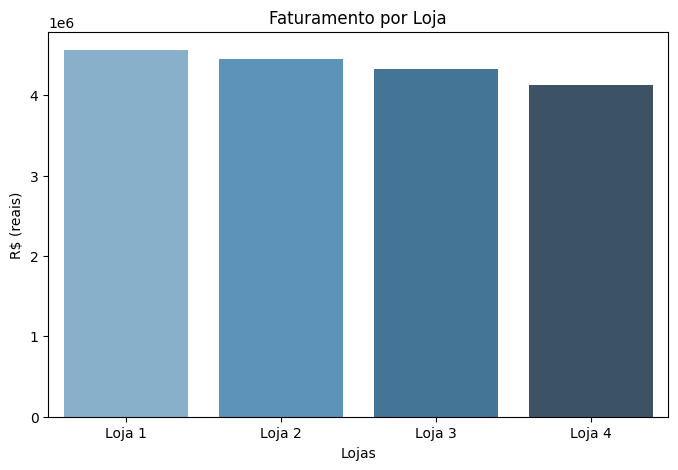
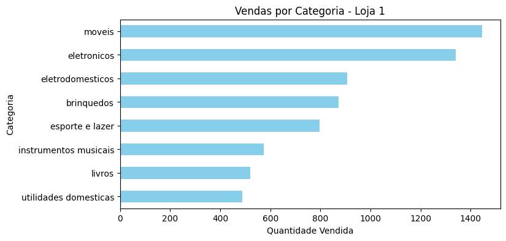
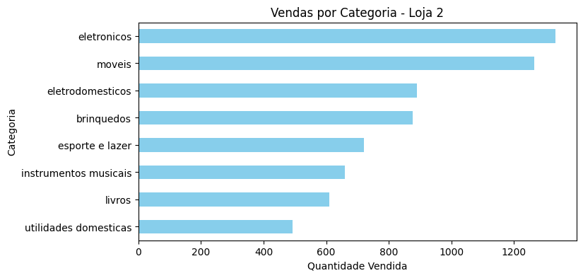
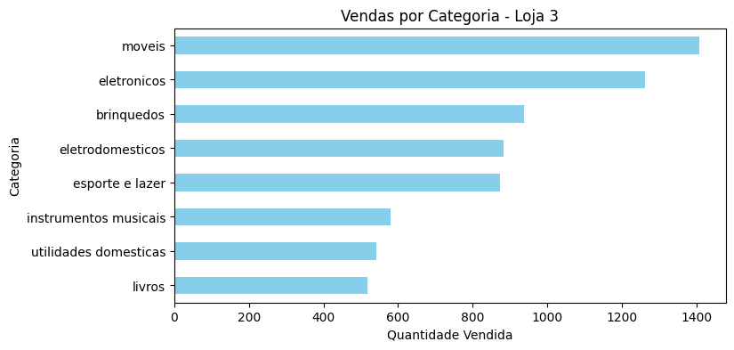
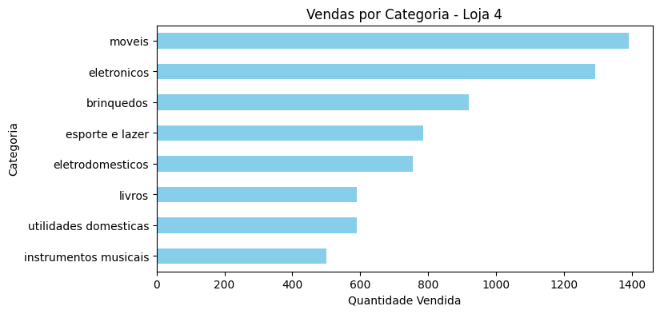

# 🛒 Desafio Alura Store — Ciência de Dados

Seja bem-vindo(a) ao primeiro desafio de análise de dados da **Alura Store**! Neste projeto, o objetivo é **ajudar o Senhor João a decidir qual das quatro lojas vender**, com base em uma análise criteriosa dos dados de vendas, faturamento, avaliações e frete médio.

---

## 📌 Objetivo

Analisar dados reais das 4 lojas da rede **Alura Store** para:

- Avaliar o desempenho de cada loja.
- Identificar pontos fracos em faturamento, frete e avaliação.
- Indicar qual loja apresenta o **pior desempenho geral** e deve ser vendida.

---

## 🧰 Ferramentas utilizadas

- 🐼 `Pandas` para manipulação de dados  
- 📊 `Matplotlib` para visualizações  
- 💻 `Google Colab` como ambiente de desenvolvimento

---

## 📈 Gráficos e Análises

### 💰 Faturamento por Loja

Análise do faturamento total de cada loja:

> Loja 4 apresenta o **menor faturamento** entre as quatro.

---

### 📦 Participação do Frete Médio

Distribuição percentual do custo médio de frete por loja:

> A **Loja 4** tem o **menor percentual de frete médio**, o que pode indicar margens apertadas ou estratégia de frete subsidiado.

---

### 📊 Vendas por Categoria (por loja)

#### 🏬 Loja 1

#### 🏬 Loja 2

#### 🏬 Loja 3

#### 🏬 Loja 4

> A **Loja 4** mostra menor volume de vendas em diversas categorias estratégicas, o que reflete em seu baixo desempenho geral.

---

## ✅ Conclusão Final

Após análise completa dos dados, foi possível observar que:

- A **Loja 4** apresenta **o menor faturamento** total.
- O **frete médio da Loja 4** é o mais baixo entre as lojas.
- Suas **vendas por categoria** são menos expressivas em comparação com as demais.
- Não há evidência de destaque em **nenhuma métrica principal** (nem faturamento, nem volume, nem frete competitivo com alto retorno).

📉 **Conclusão**: Com base nas análises realizadas, **a Loja 4 é a menos eficiente da rede** e é a **recomendação ideal para ser vendida**.

---

### 📥 Download do Notebook

Caso queira acompanhar ou reutilizar este projeto, você pode baixar o notebook completo por aqui:

👉 [`AluraStoreBr.ipynb`](./AluraStoreBr.ipynb)

